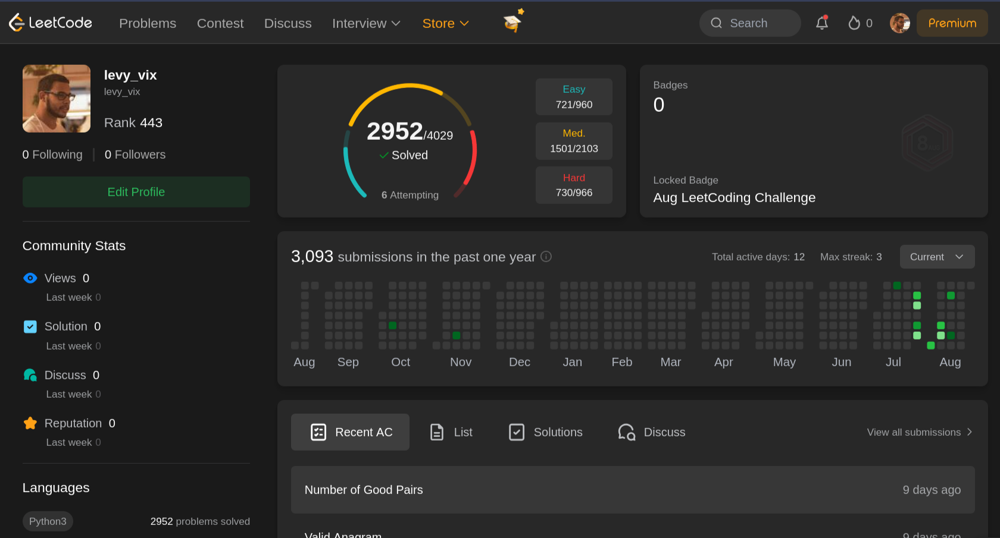

# leetbot

[Português](README.md) | [English](README.en.md)



Bot de LeetCode em Go, sem dependências externas. Replica a arquitetura descrita
em [*Solving 1,782 Leetcode questions in one day*](https://matthewtrent.me/articles/leetcode-bot):
em vez de gerar código com LLM, ele **colhe as soluções mais votadas da própria
comunidade**, valida contra os casos de exemplo e só então submete.

Validar nos exemplos antes de submeter é o que faz a diferença: o autor do
artigo original relata que isso levou a taxa de acerto de <50% para ~95%.

## Aviso

Submissão automatizada em massa viola os Termos de Serviço do LeetCode e pode
resultar em banimento da conta. **O padrão é dry-run**: sem a flag `-submit`
nada é enviado, o bot apenas roda contra os casos de exemplo. Considere usar uma
conta secundária.

## Instalação

```bash
go install github.com/levyvix/leetbot@latest
```

## Autenticação

Não há login programático (Cloudflare + captcha). Pegue os dois cookies do
navegador já logado:

1. Abra `https://leetcode.com` logado
2. DevTools (F12) → Application → Cookies → `https://leetcode.com`
3. Copie os valores de `LEETCODE_SESSION` e `csrftoken`

```bash
export LEETCODE_SESSION='eyJ...'
export LEETCODE_CSRF='abc...'

leetbot whoami
# autenticado como levy_vix (premium: false)
```

O `LEETCODE_SESSION` é um JWT com validade de ~2 semanas — quando `whoami`
retornar erro de sessão, repita o passo acima.

## Uso

### Ver a descrição de um problema

Aceita o ID que aparece na UI ou o slug:

```bash
leetbot show 1
leetbot show two-sum -lang python3
```

### Inspecionar as soluções candidatas

Roda só a etapa de colheita — não executa nem submete nada. Útil para depurar a
extração antes de gastar submissões:

```bash
leetbot harvest two-sum -lang python3
# 1. Two Sum | entry point: twoSum | 5 posts em python3
#
#   3 candidato(s) — ✅3 Method's || C++ || JAVA || PYTHON || Beginner Friendly🔥
#   1 candidato(s) — 【Video】Step by Step Easy Solution
#   5 candidato(s) — Sum MegaPost - Python3 Solution with a detailed explanation
#   ...
# total de candidatos: 12

leetbot harvest two-sum -lang python3 -articles 1 -print   # mostra o código
```

### Resolver um problema

```bash
# dry-run: colhe soluções e testa nos exemplos, não submete
leetbot solve 1 -lang python3 -print

# submete de verdade
leetbot solve 1 -lang python3 -submit
```

### Rodar em lote

```bash
# 20 problemas fáceis, dry-run
leetbot run -difficulty easy -limit 20

# submetendo, devagar
leetbot run -difficulty easy -limit 50 -submit -pause 10s

# retomar de onde parou (o estado é lido do mesmo arquivo)
leetbot run -difficulty easy -limit 200 -submit

# retentar somente os problemas que terminaram como failed
leetbot run -retry-failed -limit 0 -submit
```

O progresso vai para `state.json` após **cada** problema, então `Ctrl-C` é
seguro e a próxima execução pula o que já foi processado (exceto os que
terminaram em `error`, que são retentados).

```bash
leetbot stats
# total=20 accepted=17 failed=2 skipped=1
```

### Flags principais de `run`

| Flag | Padrão | Descrição |
| --- | --- | --- |
| `-lang` | `python3` | slug da linguagem (`java`, `cpp`, `golang`, `rust`, …) |
| `-submit` | `false` | submete de verdade |
| `-difficulty` | todas | `easy`, `medium`, `hard` |
| `-limit` | `10` | máximo de problemas nesta execução (`0` = todos) |
| `-from` | `0` | começa a partir deste ID |
| `-articles` | `8` | quantos posts de solução ler por problema |
| `-candidates` | `5` | quantos blocos de código testar por problema |
| `-pause` | `5s` | pausa entre problemas |
| `-interval` | `500ms` | intervalo mínimo entre requisições HTTP |
| `-include-solved` | `false` | não pula os já resolvidos na conta |
| `-retry-failed` | `false` | retenta somente problemas salvos como `failed` |

### Rate limit (429)

Quando o LeetCode responde `429 Too Many Requests`, o cliente inteiro entra em
cooldown — respeitando o header `Retry-After` quando existe, senão 30s dobrando
a cada 429 consecutivo, com teto de 5 min. A espera não consome o orçamento de
retries, então o `/submit/` também é reenviado depois do cooldown (o 429 é
recusado antes de chegar ao juiz, logo não duplica tentativa na conta).

Se o 429 persistir depois de 5 esperas, o problema é abandonado com status
`error` (será retentado numa execução futura) em vez de queimar os candidatos
restantes. Se isso acontecer com frequência, aumente `-pause` e `-interval`.

Além disso, a conta parece ter uma **cota de submissões de janela longa**: numa
execução real o 429 começou depois de ~480 aceitos no mesmo dia, com throughput
até então estável (~150/h), e não soltou em 10 min de tentativas. Cooldown de
minutos não resolve isso, então após 3 problemas seguidos bloqueados o run
encerra com `cota de submissões da conta esgotada`. O progresso está no
`state.json`; basta repetir o mesmo comando algumas horas depois para retomar.

## Estados possíveis

| Status | Significado |
| --- | --- |
| `accepted` | submetido e aceito |
| `tested` | passou nos exemplos, não submetido (dry-run) |
| `failed` | nenhum candidato funcionou |
| `skipped` | premium, SQL/shell/concurrency, sem stub na linguagem |
| `error` | falha de rede ou de API — será retentado |
